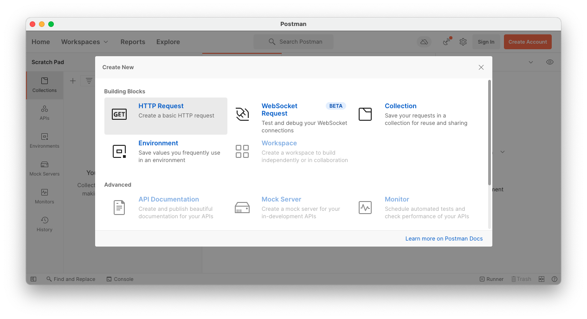

# Postman

Postman is an application that allows you to make customized requests to a particular URL and inspect the response you receive. As a web developer, it is more useful than using the browser because it readily gives you access to more information and more customization.

## Installing Postman

You can download the Postman application by clicking on the link below.

- [Postman](https://www.postman.com/downloads)

Once you've downloaded the application, it will be in your `Downloads/` directory. You will need to drag it from your `Downloads/` directory to your `Applications/` directory to completely install it.


When you open the program, you will be prompted to make an account. While you can do so, you can also skip ahead by clicking the link at the bottom of the screen.


## Making requests

When you make a request in Postman, it's as if you were to go to that page in the browser. However, with Postman, you can customize the request and the response more deeply.

To make a request with Postman, first click on the "New" button in the upper-left portion of the screen. There are a few other ways to create a new request as well.


Then, click the option that allows you to make an HTTP Request.



A new tab will open that will allow you to enter a URL. You'll enter in your URL in the gray box.


For example, in the above image the following URL was entered:

```
https://goweather.herokuapp.com/weather/Berlin
```

Finally, to make the request you will press the "Send" button.

Once you do so, you should see the bottom half of the page change. In particular, you look for the text "200 OK".


